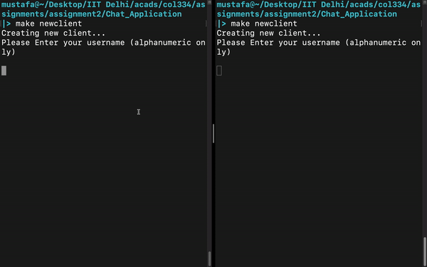
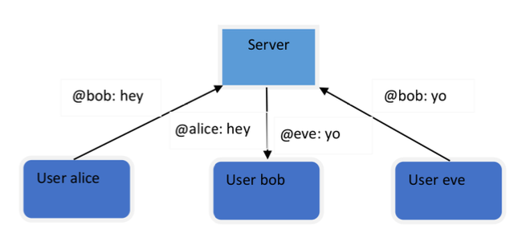

# Chat Application

Part of an assignment of course COL334. TCP sockets were used to create a simple chat application. 

A detailed description of the problem statement can be found [here](./assets/problem_statement.pdf).

### Demonstration

<p align="center">
  <br>
  A demo showing two clients chatting with each other, along with the server.
</p>


### Description

A chat application that allows users to send plain text messages with one another. The figure below shows the framework. Users can direct messages to other users using an `@[username] [message]` syntax, and the server will forward these messages to the intended recipients. The message could be intended to be sent for a single client (Unicast) or all clients (Broadcast). The messages would be communicated as plain text, so the server will be able to read the messages. This is a simpler version of any commercial chat-based application which make use of centralized servers for relaying the messages, except the fact that messages would be encrypted in the case of commercial applications.


<p align="center">
  
</p>


### Instructions to run

1. Compiling the code
```
make compile
```
This will compile all the source code used, and create executables corresponding to the server and client.

2. Running Server
```
make runserver
```
This will open the server. Once the server is running, clients can connect to it, and the chat application can start.

3. Running a single client
```
make newclient
```
or simply run the executable directly
```
bash ./client
```

Multiple clients can be created using step 3. Once the desired number of clients are ready, each client can register with the server and then start chatting!


### Basic flow of the application

1. First the server is run. In the server, a single socket is created. The server waits to receive connection requests from any client. For every connection request, a thread is created. If a thread receives a TORECV message, it registers the client's receive socket and then closes the thread. If a thread receives a TOSEND message, it registers the user and then continues waiting for other messages form the same socket. If a different message is received, while the users are not yet registered, an error 101 is sent. If the message contains an invalid username, an error 100 is sent.

2. Now when a single client is run, it opens two sockets and tries to register each of them with the server. If the sockets are not registered, it asks the user to input their username again. After registering both sockets successfully, it opens up two threads, for receiving and sending messages to the server.

3. Under normal operation, a client sends a "SEND" message to the server. The server then sends a "FORWARD" message to the client whom the message was to be sent to. That client then responds with a "RECEIVED" message to the server. Upon receiving this, the server acknoledges the sender by sending a "SEND" message. After this, a message was successfully sent from one client to the other. In the case of broadcast, the server sends messages to all clients except the sender. Only after receiveing a "RECEIVED" acknowledgement from each of these clients, the server sends a "SEND" message back to the server. If the message was not sent to even a single client, the server throws an error (Note that even if a client does not receive, the server still tries to send to other clients. It ends only after it has tried every client).

4. All the error codes and messages are abstracted away in the error.hpp file. All the REGISTER and REGISTERED messages are present in the register.hpp file. All the content messages are present in the messages.hpp file. This messages.hpp file also allows eacy parsing of the received message, and handles the cases where the message is invalid because of missing headers.